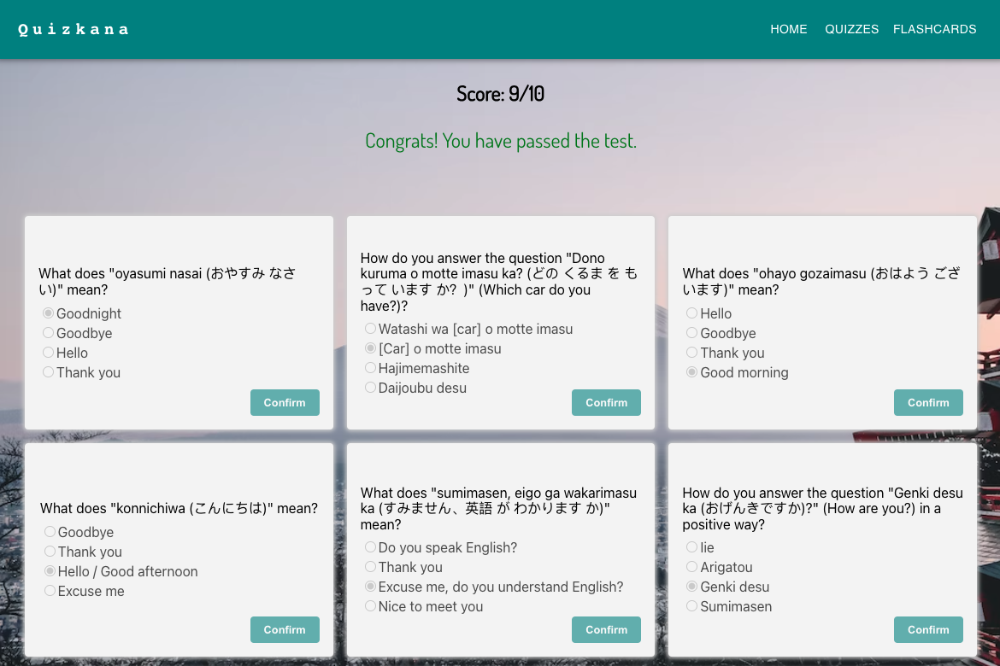

# Quizkana
Quizkana is a Japanese language learning app designed to help users improve their hiragana reading skills. With interactive quizzes and flashcards, Quizkana offers an engaging and effective way to learn and practice the fundamental characters of the Japanese writing system.

## :computer: [Click here](https://japanese-quiz-app.onrender.com/) to see my live project.

## Front-end Git Repository of this app [QuizkanaFrontEnd](https://github.com/WenhuiXu1/Japanese-Quiz-APP)

## :pencil2: Planning & Problem Solving

In developing Quizkana, my primary goal was to provide an effective and engaging solution for learning hiragana and katakana, the foundational scripts of the Japanese writing system. I recognized that mastering these characters is essential for building a strong foundation in Japanese language learning.

To address this problem, I employed a combination of pedagogical principles and techniques designed to optimize learning outcomes:

1, Flashcards reinforcement: Quizkana offers multiple set of flashcards that allow users to practice and review hiragana and katakana characters at their own pace. 

2, Interactive Quizzes: These quizzes test the user's ability to recognize and associate hiragana characters with their corresponding pronunciations. By providing immediate feedback and scoring, users can track their progress and identify areas that require further practice.

### Features
- User can select different sets of flashcards to test their knowledge.
- User can click on 'Load more' button to get more flashcards that are in order for memory reinforcement. 
- User can change their answers before the select the confirm button.
- User can see their scores and view win/lose messages after they have finished all the questions and sumbit.

### Wireframes


### Flow charts of app logic.


## User stories
- As a user, I would like to learning Japanese hiragana characters with flashcards where I can click on a flashcard and see the pronunciation of that character.
- As a user, I want to get quizzed about my knowledge of basic Japanese words.

## Project screenshots




## :page_facing_up: About
- Download instructions:
```
$ git clone https://github.com/WenhuiXu1/Japanese-Quiz-App-Back-End Quizkana
$ cd Quizkana
$ npm install
$ npm start
```

## :rocket: Tech stacks
- Javascript, Node JS, Express JS
- React JS, MUI
- API intergration
- PosgreSQL

## Bugs to fix
- When user can select the corrct answer multiple times and the points would still increase.
- When the user refresh the flashcard page, only json files returns

## :white_check_mark: Future features
- add audio for flashcards so when user click on the flashcards, they can hear the sound of the character.
- desing the quiz in a way that the user will select the characters according to the sound they hear.
- include different user groups
- implement leaderboard section on the main page to display the top scores or achievements of users 